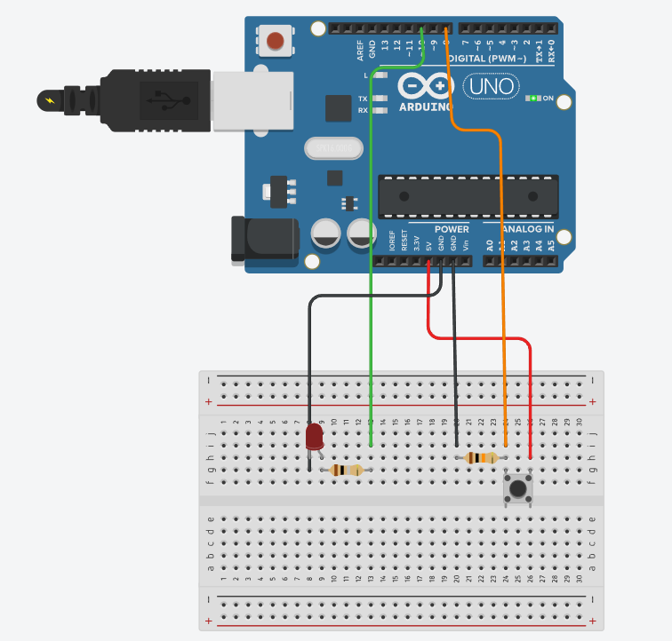

[🇹🇷 Türkçe](README.md) | [🇬🇧 English](README_EN.md)

# Python ve Arduino ile Butonla LED Kontrolü
## Proje Özeti:
Bu proje, bir fiziksel butona basıldığında seri port üzerinden Python tabanlı bir yazılım ile iletişime geçerek bir LED'in durumunu kontrol eden bir sistemdir. Arduino'nun sensör verisi toplama yetenekleri ile Python'un kontrol ve mantık işleme gücünü bir araya getirir. Bu sayede, temel elektronik ve yazılım entegrasyonu prensiplerini uygulamalı olarak gösterir.
## Ana Özellikler:
Çift Yönlü Seri İletişim: Arduino ve Python arasında gerçek zamanlı veri alışverişi sağlar. Arduino, butonun durumunu Python'a iletirken, Python da LED'i kontrol etmek için komutları Arduino'ya geri gönderir.
Ayrıştırılmış Kontrol Mimarisi: Kontrol ve mantık işlemleri Python tarafında yürütülerek, daha karmaşık algoritmaların ve potansiyel olarak gelecekte eklenecek bir grafik arayüzünün (GUI) temelini oluşturur.
Robust Hata Yönetimi: Python kodu, seri porta bağlanma veya veri okuma sırasında oluşabilecek hataları yönetmek için try-except bloklarını kullanır, böylece uygulamanın dayanıklılığını artırır.
Kolayca Genişletilebilir Tasarım: Proje, daha fazla sensör veya aktüatör eklenerek genişletilebilir ve otomasyon projeleri için bir başlangıç noktası olarak kullanılabilir.

## Kullanılan Teknolojiler:
Donanım: Arduino, LED, Buton, Dirençler(10k ve 220ohm),Jumper Kablolar
Yazılım: Python, Arduino IDE
Kütüphaneler: pyserial, time. 
# Kurulum ve Kullanım
## Yapım Aşaması
Devreyi breadboard üzerine kurarak gerekli tüm bağlantıları yapın. LED, buton ve direnç gibi devre elemanlarını uygun şekilde yerleştirin. Arduino tarafındaki kodu Arduino IDE ile hazırlayıp kartınıza yükleyin. Python tarafında ise pyserial kütüphanesini yükleyerek seri iletişim için gerekli ortamı oluşturun. Ardından Python kodunuzu, Arduino’nun gönderdiği veriyi okuyup LED kontrol komutlarını gönderecek şekilde hazırlayın. Tüm bağlantılar ve kod yüklemeleri tamamlandıktan sonra Arduino’nun bağlı olduğu portu Python kodunda doğru şekilde tanımlayıp programınızı çalıştırın
## Uygulama Aşaması
Devreyi kurduktan sonra Arduino kartınızı USB ile bilgisayara bağlayın.Arduino kodunu yükleyin.Yükleme tamamlandıktan sonra Arduino Ide'sini kapatın.COM port numarasını kendi kartınıza uygun şekilde ayarladıktan sonra,Python kodunu çalıştırın.
# Devre Şeması

