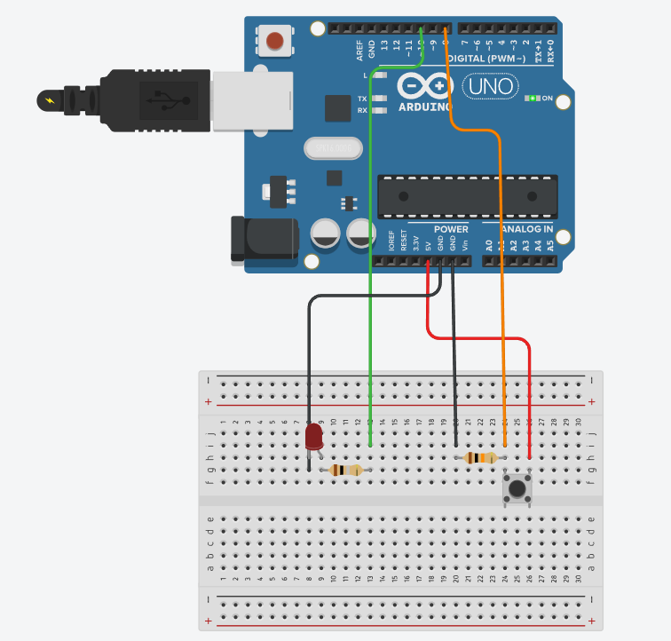

[🇹🇷 Türkçe](README.md) | [🇬🇧 English](README_EN.md)

# Python and Arduino Button-Controlled LED
## Project Overview
This project creates a system where pressing a physical button communicates with a Python-based application via a serial port to control the state of an LED. It combines Arduino's ability to collect sensor data with Python's control and logic-processing power. This approach demonstrates the principles of basic electronics and software integration in a practical way.
## Key Features
Two-Way Serial Communication: Enables real-time data exchange between Arduino and Python. Arduino sends the button's state to Python, and Python sends back commands to control the LED.
Separated Control Architecture: Logic and control processes are handled on the Python side, allowing for more complex algorithms and the potential addition of a graphical user interface (GUI) in the future.
Robust Error Handling: The Python code uses try-except blocks to manage errors that may occur during serial port connection or data reading, improving the system’s reliability.
Easily Expandable Design: The project can be extended by adding more sensors or actuators, making it a good starting point for automation projects.

# Technologies Used
Hardware: Arduino, LED, Button, Resistors (10kΩ and 220Ω), Jumper Wires
Software: Python, Arduino IDE
Libraries: pyserial, time

# Installation and Usage
## Assembly Stage
Set up the circuit on a breadboard and make all necessary connections. Place the LED, button, and resistors correctly according to the wiring diagram. Prepare the Arduino code in the Arduino IDE and upload it to your board. On the Python side, install the pyserial library to enable serial communication. Then, write your Python code to read the data sent from Arduino and send LED control commands back to it. After completing all connections and uploading the code, set the correct COM port in your Python script and run it.
## Execution Stage
After building the circuit, connect your Arduino board to the computer via USB. Upload the Arduino code. Once the upload is complete, close the Arduino IDE. Adjust the COM port number in your Python script to match your board’s port, then run the Python program.

# Circuit Diagram
  
